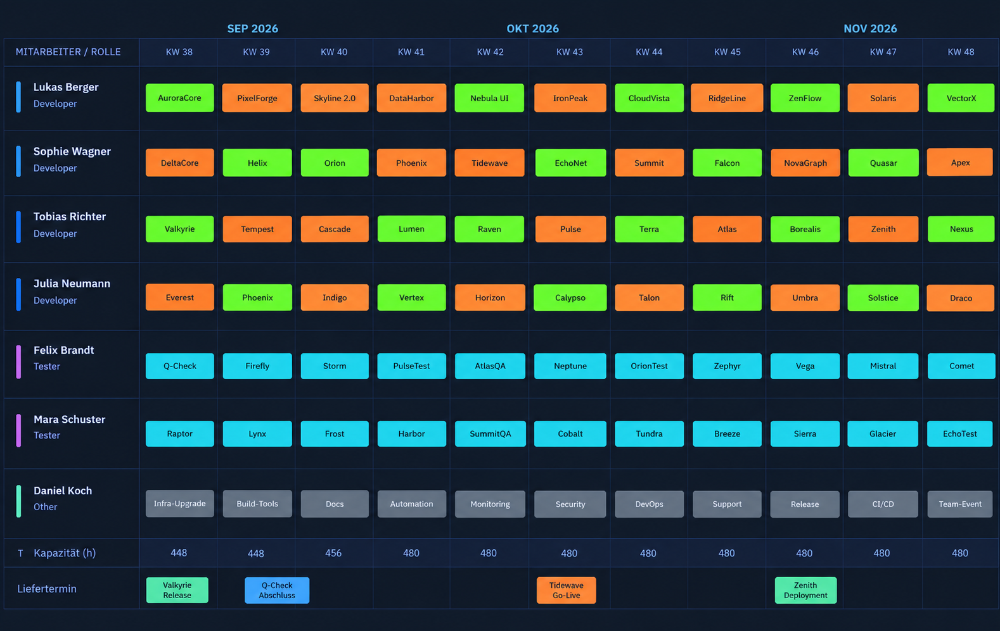

# KapaBase


KapaBase ("Kapaverwaltung") is a capacity-planning and resource-management web application for software teams. It tracks staff, project assignments, absences, worked hours, planning variants, and delivery forecasts, and visualizes them in a Gantt chart and weekly planning matrices. The UI is German-language; this document is in English.

## Table of contents

- [Features](#features)
- [Screenshots](#screenshots)
- [Tech stack](#tech-stack)
- [Project structure](#project-structure)
- [Installation](#installation)
- [Database setup](#database-setup)
- [Configuration](#configuration)
  - [acl.json — access control](#acljson--access-control)
  - [config.json — application settings](#configjson--application-settings)
  - [sync.json — Jira synchronization](#syncjson--jira-synchronization)
  - [sync_ignore.json — permanently ignored sync items](#sync_ignorejson--permanently-ignored-sync-items)
- [Running the application](#running-the-application)
  - [Running as a systemd service](#running-as-a-systemd-service)
- [Module overview](#module-overview)
- [Domain terminology (German UI)](#domain-terminology-german-ui)

## Features

- **Staff management** — employees with weekly/daily hours, roles (Developer / Tester / Other), and an optional active-from/active-to window; absences and plannings outside that window are cleaned up automatically.
- **Absence management** — vacation, sick leave, GLAZ (flexitime), "Other", and bulk-created team days; working-day counts exclude weekends and holidays; fiscal-year filtering.
- **Project management** — target/implementation/test hours, project type (`Project` / `Operations` / `Internal`), customer, delivery dates, color coding, and capacity-vs-demand overview with charts.
- **Planning matrix** — weekly drag-free (click-to-assign) resource planning per staff member and role, with split assignments (Mon–Wed / Thu–Fri) when two projects share a week, partial-absence styling, automatic "default task" placeholders, and multiple **planning variants** (what-if scenarios) that can be copied, activated, and compared.
- **Gantt chart** — continuous project bars, planned vs. actual delivery week markers, and milestones with color schemes.
- **Worked-hours tracking** — per-project time entries with a burndown chart and an "open hours" entry mode that back-calculates booked hours from the remaining balance.
- **Delivery forecasting** — burndown-based forecast chart for the next N projects.
- **Jira synchronization** — pulls and pushes project data to/from Jira (Cloud or Server), with a diff/preview UI, per-item permanent ignore list, and optional automated email notifications.
- **Access control** — simple per-page, per-action allow-list based on client IP/hostname (see [`acl.json`](#acljson--access-control)).

## Screenshots

**Planning matrix** — weekly resource assignment per staff member and role, with capacity and delivery-week summary rows:



> Additional screenshots (Gantt, projects, absences, etc.) can be dropped into `application/static/screenshots/` and referenced here the same way.

## Tech stack

- **Backend:** FastAPI (Python) with PostgreSQL via `psycopg2`
- **Scheduling:** APScheduler (Jira sync / notifications)
- **Holidays:** `python3-holidays` (Austria), plus custom `additional_holidays`
- **Frontend:** Jinja2 templates and vanilla JavaScript (no framework), with a shared `api()` fetch helper and `toast()` notifications in `base.html`

## Project structure

```
application/
├── main.py                 # FastAPI app, page routes, router registration
├── db.py                   # psycopg2 connection / cursor context manager
├── capacity.py              # working-day and capacity calculations, holidays
├── acl.py                   # access-control check (acl.json)
├── sync_engine.py            # generic sync abstraction (adapters, ignore store)
├── sync_jira.py              # Jira sync adapter implementation
├── scheduler.py              # APScheduler setup (not shown here)
├── notification.py           # email notifications (not shown here)
├── routers/                  # one module per resource, mounted under /api/*
│   ├── staff.py, absence.py, projects.py, tasks.py, default_task.py
│   ├── planning.py, planning_variants.py, milestones.py
│   ├── worked_hours.py, forecast.py, charts.py
│   ├── sync.py, sync_config.py, config.py, notifications.py
├── templates/                 # Jinja2 templates (one per page) + base.html
├── static/                    # logo, favicon, images
│   ├── logo.png                # displayed in the navbar and at the top of this README
│   └── screenshots/             # README screenshots, e.g. planning.png
├── config.json                # application settings (see below)
├── config.json.example        # template for config.json
├── acl.json                   # access control list (see below)
├── sync.json                  # Jira sync sources (see below)
└── sync_ignore.json            # auto-managed, permanently ignored sync items

setup/
└── database.sql               # PostgreSQL schema
```

## Installation

There are two supported ways to install the Python dependencies: a generic `pip`-based install (any platform), or the Debian/Ubuntu-specific `apt`-package install used in production (see `setup/install.txt`). Pick one.

### Option A — generic (pip)

**Prerequisites:** Python 3.10+, PostgreSQL 13+, `pip`

1. **Clone the repository** and change into the `application/` directory.

2. **Install Python dependencies:**

   ```bash
   pip install fastapi uvicorn jinja2 python-multipart \
               psycopg2-binary pydantic \
               apscheduler holidays requests
   ```

   > Adjust to a `requirements.txt` if one exists in your checkout; the packages above are the ones imported by the application code.

3. Continue with [Database setup](#database-setup), then [Configuration](#configuration), then [Running the application](#running-the-application).

### Option B — Debian/Ubuntu (apt packages)

This is the installation path used for production deployments of KapaBase (see `setup/install.txt`). Instead of `pip`, the Python dependencies are installed as Debian packages, and the app runs as a `systemd` service (see [Running as a systemd service](#running-as-a-systemd-service)).

**Prerequisites:** a Debian/Ubuntu host with `sudo` access and PostgreSQL already installed (`postgresql` package).

1. **Clone/deploy the repository**, e.g. to `/opt/kapabase`, so that `application/` (containing `main.py`) ends up directly under that directory — this path must match `WorkingDirectory` in the systemd unit (see below).

2. **Install `uvicorn` and the required Python packages as Debian packages:**

   ```bash
   sudo apt update
   sudo apt install uvicorn
   sudo apt install python3-fastapi python3-uvicorn python3-psycopg2 python3-jinja2 python3-matplotlib python3-holidays
   sudo apt install python3-apscheduler
   ```

   > `python3-matplotlib` is required for server-side chart rendering (`routers/charts.py`); the pip-based install in Option A pulls this in transitively via other packages, but on Debian it must be installed explicitly.

3. **Create the PostgreSQL role and database:**

   ```bash
   # 1. Create the "planning" user with password "planning"
   sudo -u postgres createuser planning --pwprompt

   # 2. Create the "planning" database, owned by the "planning" user
   sudo -u postgres createdb -O planning planning
   ```

4. **Load the schema** (run from the directory containing `database.sql`, e.g. `setup/`):

   ```bash
   psql -U planning -d planning -f database.sql
   ```

5. **Create the configuration files** (see [Configuration](#configuration)):
   - `config.json` (copy from `config.json.example` and adjust)
   - `acl.json` (create manually — see below; if absent, all edit actions are denied by default)
   - `sync.json` (only needed if you use Jira synchronization)

6. **Install and start the systemd service** (see [Running as a systemd service](#running-as-a-systemd-service)):

   ```bash
   sudo systemctl restart kapaBase.service
   sudo journalctl -u kapaBase.service -n 100 --no-pager
   ```

   `journalctl` shows the last 100 log lines — use it to confirm the service started cleanly and to diagnose startup failures (e.g. missing packages, database connection errors, invalid `config.json`).

## Database setup

The schema is defined in `setup/database.sql`. Create the database and user, then apply the schema:

```bash
psql -h localhost -U postgres -c "CREATE USER planning WITH PASSWORD 'planning';"
psql -h localhost -U postgres -c "CREATE DATABASE planning OWNER planning;"
psql -h localhost -U planning -d planning -f setup/database.sql
```

Key tables: `project`, `tasks`, `staff`, `roles`, `absence`, `worked_hours`, `planning_variant`, `planning`, `milestone`, `default_task`.

Notes:

- `planning_variant` enforces at most one active variant at a time via a partial unique index.
- `planning.task_id` and `planning.project_id` are mutually exclusive (a planning entry belongs to either a task or a project, never both).
- `project.color_hexcode` and `tasks.color_hexcode` must be unique across their respective tables; the application auto-increments a suggested color on a uniqueness conflict.

## Configuration

### `acl.json` — access control

Located at `application/acl.json` (not committed by default — create it yourself). It controls whether a visitor sees the **edit** UI (buttons, forms) on each page, based on their client IP address or a resolvable hostname.

Structure — one entry per **scope** (matches the page/router name), each with one or more **actions** (currently only `"edit"` is used) mapped to a list of allowed hosts:

```json
{
  "staff":              { "edit": ["127.0.0.1", "10.0.0.5", "planner.internal.example.com"] },
  "absence":            { "edit": ["127.0.0.1"] },
  "projects":           { "edit": ["127.0.0.1"] },
  "tasks":              { "edit": ["127.0.0.1"] },
  "default_task":       { "edit": ["127.0.0.1"] },
  "planning":           { "edit": ["127.0.0.1"] },
  "planning_variants":  { "edit": ["127.0.0.1"] },
  "gantt":              { "edit": ["127.0.0.1"] },
  "worked_hours":       { "edit": ["127.0.0.1"] },
  "planning_status":    { "edit": [] }
}
```

Behavior (`acl.py`):

- The check matches the request's client IP directly against the allow-list first.
- If no direct IP match is found, every non-IP-looking entry in the allow-list is resolved via forward DNS (`socket.getaddrinfo`) and compared against the client IP — this lets you allow a hostname instead of a hard-coded IP.
- If `acl.json` is missing or invalid, **all** scopes default to "no edit rights" (view-only).
- List every page's scope name explicitly; a scope not present in the file also defaults to view-only.

> The `planning_status` page is a read-only view by design — even with edit rights it accepts no writes.

### `config.json` — application settings

Copy `config.json.example` to `config.json` and adjust. All groups are optional; the application falls back to sensible defaults if a group or key is missing.

```json
{
  "release": {
    "start_month": 5,
    "start_day": 1,
    "end_month": 3,
    "end_day": 31
  },
  "fiscal_year": {
    "start_month": 7,
    "start_day": 1
  },
  "planning_buffer": {
    "percentage": 20
  },
  "additional_holidays": [
    "2026-12-24",
    "2026-12-31"
  ]
}
```

| Group              | Key                          | Purpose |
|---------------------|-------------------------------|---------|
| `release`           | `start_month`, `start_day`, `end_month`, `end_day` | Defines the "current release" window used by the projects page filter (e.g. 1 May–31 March of the following year). |
| `fiscal_year`       | `start_month`, `start_day`    | Defines the start of the current fiscal year, used to filter/aggregate absences. |
| `planning_buffer`   | `percentage`                  | Extra percentage added on top of a project's open hours before it counts as "fully planned" (affects the green/red status and the calculated actual delivery week). `0` disables the buffer. |
| `additional_holidays` | array of `YYYY-MM-DD` strings | Company-specific non-working days (e.g. shutdown days, bridge days) added on top of the official Austrian public holidays. Read with mtime-based caching, so changes take effect without a restart. |

`config.json` is reloaded automatically for `additional_holidays` (cache invalidated on file change) and can be force-reloaded in full via `POST /api/config/reload`.

### `sync.json` — Jira synchronization

Located at `application/sync.json`. Defines one or more **sync sources** per **router** (currently the `projects` router is the intended consumer). Each source is polled on demand via the sync UI (`Projekte → Jira-Sync`) and produces a create/update preview before anything is written to the database.

```json
{
  "version": "1.0",
  "sync_sources": {
    "projects": [
      {
        "id": "jira_projects",
        "type": "jira",
        "enabled": true,
        "description": "Main Jira project sync",
        "jira": {
          "base_url": "https://your-domain.atlassian.net",
          "email": "jira-bot@example.com",
          "api_key": "REPLACE_WITH_API_TOKEN",
          "api_version": "3",
          "projects": ["PROJ"],
          "import_query": "project = PROJ AND issuetype = Epic AND statusCategory != Done",
          "field_mapping": {
            "summary":             "project_name",
            "customer":            "customer",
            "timeoriginalestimate": "target_hours",
            "duedate":             "due_date",
            "status":              "_jira_status"
          },
          "status_mapping": {
            "Done":       { "done": true },
            "To Do":      { "done": false, "planned": false },
            "In Progress":{ "done": false, "planned": true }
          },
          "defaults": {
            "project_type": "Project",
            "planned": true
          }
        }
      }
    ]
  }
}
```

Field reference (`jira` object, consumed by `sync_jira.py`):

| Key | Required | Description |
|-----|----------|--------------|
| `base_url` | yes | Jira base URL, without trailing slash. Also exposed read-only to the frontend via `GET /api/sync/config/jira_base_url` for building "open in Jira" links. |
| `email` | yes | Jira account email. |
| `api_key` | yes | API token (Jira Cloud) or Bearer token (Jira Server). |
| `api_version` | no (default `"3"`) | `"3"` for Jira Cloud (Basic auth with base64 `email:api_key`); any other value is treated as Jira Server/Data Center (`Bearer` token auth against API v2-style endpoints). |
| `projects` | no | Informational list of Jira project keys this source covers. |
| `import_query` | no | JQL used to discover **new** issues (not yet linked to a local project) to offer as "create" diffs. Leave empty to only sync already-linked projects (those with `project.jira_id` set). |
| `field_mapping` | no | Maps Jira field IDs (e.g. `summary`, custom field IDs) to local `project` columns. The special target `_jira_status` looks up the Jira field's raw value in `status_mapping` instead of writing it directly. |
| `status_mapping` | no | Maps a Jira status name to a partial set of local column overrides (e.g. flipping `done`/`planned`). |
| `defaults` | no | Default values applied to every mapped project before Jira's own values are layered on top. |

Behavior notes:

- Time fields mapped to `target_hours` / `impl_hours` / `test_hours` are expected in **seconds** (as Jira returns them, e.g. `timeoriginalestimate`) and are converted to whole hours.
- If a locally recorded impl/test split already sums to the new target hours, the existing split is preserved instead of being overwritten by Jira's (possibly different) breakdown.
- New projects get an automatically assigned, still-unused color from a predefined palette (falling back to a random hex color).
- Both `enabled: false` sources and permanently ignored external IDs (see below) are skipped.

### `sync_ignore.json` — permanently ignored sync items

Located at `application/sync_ignore.json`. This file is **managed automatically** by the "Nie synchronisieren" (never sync) checkbox in the sync preview UI — you normally don't need to edit it by hand.

```json
{
  "projects": {
    "jira_projects": ["PROJ-123", "PROJ-456"]
  }
}
```

Structure: `{ "<router>": { "<source_id>": ["<external_id>", ...] } }`. Entries are added via `POST /api/sync/{router}/{source_id}/ignore` and removed via `DELETE /api/sync/{router}/{source_id}/ignore/{external_id}`.

## Running the application

Development server with auto-reload:

```bash
cd application
python main.py
```

or directly via uvicorn:

```bash
cd application
uvicorn main:app --host 0.0.0.0 --port 8000 --reload
```

The application serves both the API (`/api/...`) and the server-rendered frontend pages (`/`, `/staff`, `/absence`, `/projects`, `/tasks`, `/default_task`, `/planning`, `/planning_variants`, `/gantt`, `/worked_hours[/{project_id}]`, `/planning_status`) on the same port. A background scheduler (APScheduler) starts and stops with the application lifespan for scheduled Jira sync / notification jobs.

For production, run behind a process manager and reverse proxy (e.g. `uvicorn` managed by `systemd` behind `nginx`), disable `--reload`, and ensure `acl.json` reflects the real network topology from which edit access should be permitted.

### Running as a systemd service

A ready-to-adapt unit file is provided at `setup/kapaBase.service`:

```ini
[Unit]
Description=KapaBase
After=network.target postgresql.service

[Service]
Environment=PYTHONUNBUFFERED=1
User=username
WorkingDirectory=/opt/kapabase
ExecStart=/usr/bin/uvicorn main:app --host 0.0.0.0 --port 8000 --log-config log_config.json
Restart=always

[Install]
WantedBy=multi-user.target
```

To install it:

1. **Copy the unit file** into systemd's search path and adjust it for your environment:

   ```bash
   sudo cp setup/kapaBase.service /etc/systemd/system/kapaBase.service
   sudo nano /etc/systemd/system/kapaBase.service
   ```

   At minimum, adjust:
   - `User` — the Linux user the service should run as (must have read access to the application directory and, if you set DB credentials via environment variables, permission to see them).
   - `WorkingDirectory` — must point at the `application/` directory (the one containing `main.py`, `config.json`, `acl.json`, etc.), e.g. `/opt/kapabase/application`.
   - `ExecStart` — verify the path to `uvicorn` (`which uvicorn`, typically `/usr/bin/uvicorn` after the `apt install uvicorn` step). The `--log-config log_config.json` option is optional — omit it (or provide your own `log_config.json` in `WorkingDirectory`) if you don't need custom log formatting.
   - Optionally add `Environment=DB_HOST=...`, `Environment=DB_PASS=...` etc. (one line per variable) if you don't want to rely on the defaults in `db.py`.

2. **Reload systemd, enable, and start the service:**

   ```bash
   sudo systemctl daemon-reload
   sudo systemctl enable kapaBase.service
   sudo systemctl start kapaBase.service
   ```

3. **Check status and logs:**

   ```bash
   sudo systemctl status kapaBase.service
   sudo journalctl -u kapaBase.service -n 100 --no-pager
   ```

4. **After deploying an update**, restart the service to pick up code changes:

   ```bash
   sudo systemctl restart kapaBase.service
   sudo journalctl -u kapaBase.service -n 100 --no-pager
   ```

   Note: `config.json` (for `additional_holidays`) and Jira sync configuration are re-read without a restart (mtime-based cache invalidation / on-demand reads); a full reload of all of `config.json` can also be triggered via `POST /api/config/reload`. Code changes always require a service restart.

## Module overview

| Page | Router | Purpose |
|------|--------|---------|
| Mitarbeiter (Staff) | `routers/staff.py` | Employee master data, roles, active window |
| Abwesenheiten (Absences) | `routers/absence.py` | Vacation/sick/GLAZ/team-day tracking |
| Projekte (Projects) | `routers/projects.py` | Project master data, capacity overview, Jira sync trigger |
| Tasks | `routers/tasks.py` | Internal/operations tasks assignable in planning |
| Standardtask (Default task) | `routers/default_task.py` | Fallback task shown when no real planning exists for a week |
| Planung (Planning) | `routers/planning.py` | Weekly resource-assignment matrix, project/task delivery status |
| Varianten (Planning variants) | `routers/planning_variants.py` | What-if planning scenarios |
| Gantt | `routers/planning.py` (`/gantt`) | Project timeline with milestones |
| Stundenerfassung (Worked hours) | `routers/worked_hours.py` | Actual time booked per project |
| Planungsstatus (Planning status) | `routers/planning.py` (`/`) | Read-only planning matrix, filterable by project/task |
| Sync | `routers/sync.py`, `sync_engine.py`, `sync_jira.py` | Jira preview/apply/ignore workflow |
| Charts | `routers/charts.py` | Server-rendered SVG/PNG charts (burndown, capacity, forecast) |
| Config | `routers/config.py`, `routers/sync_config.py` | Read-only config exposure to the frontend |

## Domain terminology (German UI)

| German | English |
|--------|---------|
| Kalenderwoche / KW | Calendar week |
| Planungsvariante | Planning variant |
| Liefertermin Ist / Soll | Actual / planned delivery date |
| Planwert / Sollstunden | Target hours |
| Restaufwand | Remaining effort |
| Abwesenheit | Absence |
| Stundenerfassung | Worked-hours tracking |
| Teamtag | Team day |
| Feiertage | Public holidays |
| Betriebsurlaub | Company shutdown |
| Fenstertage | Bridge days |
| Chip | Planning assignment block in the UI |
